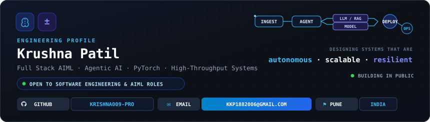
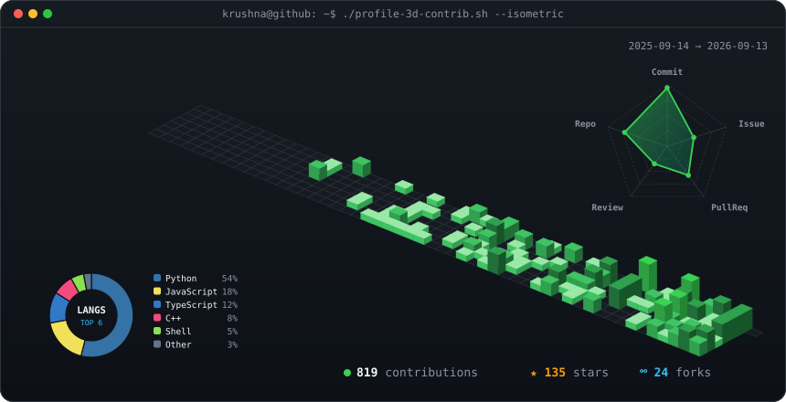
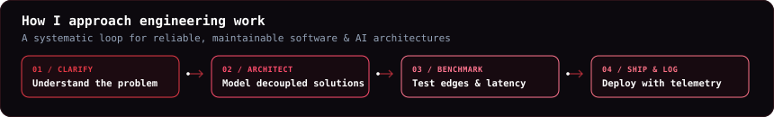

<!-- Hero Banner Card (Engineering Profile & Architecture Flow) -->

 

<!-- Dynamic Animated Typing Bar (Cyber Cyan Theme) -->

 

<table>
  <tr>
    <td valign="top"></td>
    <td valign="top"></td>
  </tr>
</table>

  

<!-- 3D Isometric Contribution Graph & Activity Radar -->

  

  

---

### 🧠 About Me

> *"I enjoy building things — whether that's an ML model, an agentic AI system, a full-stack app, or a reliable data pipeline."*

I'm an **AI & Data Science** undergraduate at **Indira College of Engineering and Management (ICEM), Pune**. My focus centers on architecting **autonomous agentic systems, high-performance web backends, and production-grade computer vision pipelines**.

- 🎓 **Education:** Pursuing **B.Tech in AI & Data Science** (2024 – 2028) — ICEM Pune | Diploma in Computer Engineering — GGSP Polytechnic
- 🔭 **Currently Engineering:** Autonomous Multi-Agent workflows, edge computer vision defect detectors & scalable full-stack apps
- 🌱 **Deepening Expertise:** Reinforcement Learning, MLOps orchestration pipelines, Distributed Agent Frameworks
- ⚡ **Philosophy:** Writing clean, decoupled, and benchmarked code that solves mission-critical problems

 

<!-- Core Engineering Pillars -->

 

---

### 🛠️ Tech Stack & Ecosystem

<table>
  <tr>
    <td width="28%" valign="middle" align="left">
      <b>⚡ Languages &amp; Runtimes</b> 
      Python, C++, C, Java, TypeScript, JavaScript, PHP
    </td>
    <td align="left">
      
    </td>
  </tr>
  <tr>
    <td width="28%" valign="middle" align="left">
      <b>🧠 AI, ML &amp; Computer Vision</b> 
      PyTorch, Scikit-Learn, TensorFlow, OpenCV
    </td>
    <td align="left">
      
    </td>
  </tr>
  <tr>
    <td width="28%" valign="middle" align="left">
      <b>🌐 Backend &amp; Web Frameworks</b> 
      FastAPI, React.js, Node.js, Express, TailwindCSS, HTML5, CSS3
    </td>
    <td align="left">
      
    </td>
  </tr>
  <tr>
    <td width="28%" valign="middle" align="left">
      <b>🗄️ Databases &amp; Cloud Storage</b> 
      MongoDB, MySQL, Supabase, Firebase
    </td>
    <td align="left">
      
    </td>
  </tr>
  <tr>
    <td width="28%" valign="middle" align="left">
      <b>🛠️ DevOps, Systems &amp; Tooling</b> 
      Docker, Linux, Git, Android, VS Code, Postman
    </td>
    <td align="left">
      
    </td>
  </tr>
</table>

 

---

<!-- How I Approach Engineering Work (Workflow Loop) -->

 

---

### 🚀 Featured Projects

#### 🌉 [ML-Driven Bridge Maintenance & Lifespan Prediction System](https://github.com/Krishna009-pro/ML-Driven-Bridge-Maintenance)
> `Python` · `OpenCV` · `Machine Learning` · `IoT Telemetry` · 
- Synthesizes real-time IoT vibration and strain telemetry with machine learning regression models to predict structural fatigue and degradation indices.
- Engineered automated **computer vision crack detection** using OpenCV morphological contouring and filtering to flag defects at scale.

#### 🎓 [Student Hub — Accommodation & Course Tracker](https://github.com/Krishna009-pro/students-accommodation-finder)
> `MongoDB` · `Express.js` · `React.js` · `Node.js` · 
- Full-stack MERN ecosystem built to streamline student housing discovery, roommate verification, and academic milestone tracking.
- Architected normalized MongoDB schemas with aggregation pipelines, JWT authentication, and a responsive modern dashboard.

#### ☁️ [Aura Drive — Cloud File & Media Vault](https://github.com/Krishna009-pro/aura-drive)
> `React` · `FastAPI` · `ImageKit.io` · `Cloud Storage` · 
- Asynchronous high-throughput media storage vault supporting categorized file uploads, live streaming, and instant asset transformation.
- Powered by a Python FastAPI asynchronous backend interfacing with ImageKit CDN and client-side React state handling.

#### 🤖 [Desktop Jarvis — Voice-Driven AI Assistant](https://github.com/Krishna009-pro/Desktop-Jarvis)
> `Python` · `NLP` · `System Automation` · 
- Hands-free desktop voice assistant executing operating system routines, background automation, and real-time natural language query routing.
- Built with non-blocking audio event loops and intent parsing for low-latency command dispatch.

#### 🌟 [StorySpark AI — Interactive Storytelling Platform](https://github.com/Krishna009-pro/story-spark-ai)
> `AI/LLM` · `Full-Stack` · `Prompt Engineering` · 
- Interactive generative AI storytelling engine that dynamically builds branching storylines based on user decisions while preserving narrative memory.
- Enforces strict JSON prompt contracts to ensure consistent world rules and character persona retention across turns.

 

---

### ⚡ Problem Solving &amp; Competitive Programming

&nbsp;&nbsp;

 

---

### 📊 Real-Time GitHub Analytics

<!-- GitHub Stats & Velocity (Stars, Commits, PRs, Contributed-to) -->

 

---

### 📬 Connect &amp; Collaborate

  <b>Let's build resilient, high-impact systems together.</b> 
  Whether you have an opportunity in agentic AI architectures, scalable full-stack development, technical collaborations, or open-source engineering — my inbox is always open!

  
  &nbsp;&nbsp;
  
  &nbsp;&nbsp;
  

 

<!-- Dynamic Cyber Architecture Footer Banner -->

  

  

⚡ Built with pure SVG architecture & refreshed daily via GitHub Actions · Krushna Patil &copy; 2025–2026

