<!-- Terminal Header: Live Contributions -->
<h3><code>krushna@github ~ $ ./contributions.sh --live</code></h3>

  

<!-- Terminal Header: Whoami / Neofetch -->
<h3><code>krushna@github ~ $ whoami && neofetch</code></h3>

<table>
  <tr>
    <td valign="top"></td>
    <td valign="top"></td>
  </tr>
</table>

 

<!-- Dynamic Animated Typing Bar -->

  

<!-- Quick Connect & Socials -->

  
  
  
  

 

---

### 🧠 About Me

> *"I enjoy building things — whether that's an ML model, an agentic AI system, a full-stack app, or a reliable data pipeline."*

I'm a **Full Stack AIML & Data Science** student at **Indira College of Engineering and Management (ICEM), Pune**. Most of my work is self-driven and research-focused, actively applying core theoretical foundations to build **scalable, production-grade applications**.

- 🎓 Pursuing **B.Tech in AI & Data Science** (2024 – 2028) — ICEM, Pune
- 🏆 Diploma in Computer Engineering — GGSP Polytechnic, Nashik
- 🔭 **Currently building:** Autonomous Agentic AI systems & full-stack AI-powered apps
- 🌱 **Exploring:** Reinforcement Learning, MLOps pipelines, Multi-Agent Architectures
- 💬 **Ask me about:** Python, FastAPI, React/Node.js, Agentic AI, PyTorch

 

---

### 🛠️ Tech Stack & Ecosystem

 

---

### 🚀 Featured Projects

#### 🌉 ML-Based Bridge Lifespan Prediction System
> `Python` · `OpenCV` · `Machine Learning` · `IoT`
- Predicts bridge structural durability and maintenance schedules by synthesizing ML models with IoT sensor telemetry.
- Integrated **computer vision for automated crack detection** to automate structural defect identification at scale.

#### 🎓 Student Hub — Accommodation & Course Tracker
> `MongoDB` · `Express.js` · `React.js` · `Node.js`
- Full-stack MERN platform resolving student pain points in finding housing and monitoring academic progress.
- Architected the complete stack from database schemas and authentication to responsive frontend UI.

#### ☁️ Drive System — Cloud File & Image Storage
> `React` · `FastAPI` · `ImageKit.io` · `Cloud Storage`
- Cloud storage platform for uploading, categorizing, and streaming files remotely.
- Built a high-performance Python FastAPI backend interfacing with React frontend for asynchronous I/O.

#### 🤖 Voice Assistant — Jarvis
> `Python` · `NLP` · `Automation`
- Personal voice-driven assistant executing system tasks, automated workflows, and natural language command parsing.

 

---

### 🏆 Hackathons & Competitions

| Event | Project | Highlight |
|---|---|---|
| 🏦 **EY Techathon 6.0** (BFSI Domain) | **AI-Based Loan Chatbot** | Agentic AI & Master-Worker architecture for loan eligibility in banking |
| 🔥 **Meta PyTorch Hackathon** | **CodeForge Pro** | Applied Reinforcement Learning (RL) inside structured coding environments |
| 🏥 **Mumbai Hackathon** | **Healthcare Management System** | Rapid full-stack prototyping & system architecture under 24hr pressure |
| 🎓 **College Hackathon** | **Web-Based MVP** | Shipped production-ready MVP in a fast-paced 24–48hr sprint |

 

---

### 📊 Real-Time GitHub Analytics

 

---

  ⚡ Auto-rendered as self-contained SVG & refreshed daily via GitHub Actions · Zero 3rd-party dependencies

